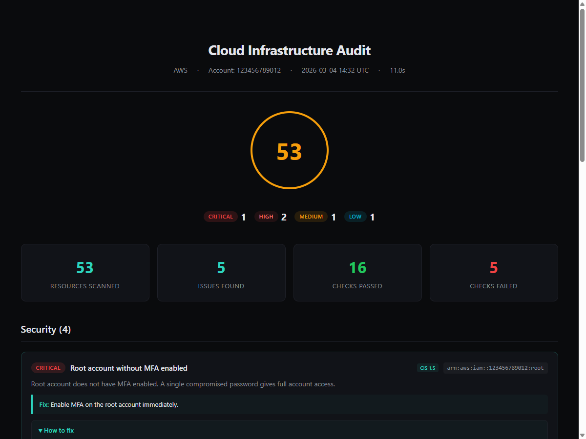

<p align="center">
  
</p>

<!-- mcp-name: io.github.gebalamariusz/cloud-audit -->
<h1 align="center">cloud-audit</h1>

<p align="center">
  <strong>Find AWS attack chains and get exact fixes.</strong>
</p>

<p align="center">
  Open-source CLI that correlates findings into exploitable paths,<br>
  generates copy-paste remediation, and simulates fixes before you apply them.
</p>

<p align="center">
  Detect exploitable attack paths &nbsp;-&nbsp; Get AWS CLI + Terraform fixes &nbsp;-&nbsp; Run locally, no SaaS required
</p>

<p align="center">
  <a href="https://pypi.org/project/cloud-audit/"></a>
  <a href="https://pypi.org/project/cloud-audit/"></a>
  <a href="https://github.com/gebalamariusz/cloud-audit/actions/workflows/ci.yml"></a>
  <a href="https://opensource.org/licenses/MIT"></a>
  <a href="https://pypi.org/project/cloud-audit/"></a>
  <a href="https://ghcr.io/gebalamariusz/cloud-audit"></a>
  <a href="https://www.helpnetsecurity.com/2026/03/11/cloud-audit-open-source-aws-security-scanner/"></a>
  <a href="https://glama.ai/mcp/servers/gebalamariusz/cloud-audit"></a>
  <a href="https://haitmg.pl/cloud-audit/"></a>
</p>

<p align="center">
  <a href="https://haitmg.pl/cloud-audit/">Documentation</a> -
  <a href="https://haitmg.pl/cloud-audit/getting-started/quick-start/">Quick Start</a> -
  <a href="https://haitmg.pl/cloud-audit/compliance/overview/">Compliance</a> -
  <a href="https://haitmg.pl/cloud-audit/compliance/cis-aws-v3/">CIS</a> -
  <a href="https://haitmg.pl/cloud-audit/compliance/soc2-type2/">SOC 2</a> -
  <a href="https://haitmg.pl/cloud-audit/compliance/bsi-c5-2020/">BSI C5</a> -
  <a href="https://haitmg.pl/cloud-audit/compliance/iso27001-2022/">ISO 27001</a> -
  <a href="https://haitmg.pl/cloud-audit/compliance/hipaa-security/">HIPAA</a> -
  <a href="https://haitmg.pl/cloud-audit/compliance/nis2-directive/">NIS2</a> -
  <a href="https://haitmg.pl/cloud-audit/features/attack-chains/">Attack Chains</a> -
  <a href="https://haitmg.pl/cloud-audit/features/mcp-server/">MCP Server</a>
</p>

## Quick Start

```bash
pip install cloud-audit
cloud-audit scan
```

Uses your default AWS credentials and region. Try without an AWS account:

```bash
cloud-audit demo
```

---

## What You Get

```
+------- Health Score -------+
| 34 / 100                   |   Risk exposure: $1.2M - $9.5M
+----------------------------+

+---- Attack Chains (5 detected) -----------------------------------+
|  CRITICAL  Internet-Exposed Admin Instance                         |
|            i-0abc123 - public SG + admin IAM role + IMDSv1         |
|                                                                    |
|  CRITICAL  IAM Privilege Escalation via iam:PassRole               |
|            ci-deploy-role - 3-step path to admin                   |
|                                                                    |
|  CRITICAL  CI/CD to Admin Takeover                                 |
|            github-deploy - OIDC no sub + admin policy              |
+--------------------------------------------------------------------+

+---- Remediation Plan -------------------------------------------+
|  Fix 4 root causes, break 22 attack chains                       |
|                                                                    |
|  Quick Wins (effort: LOW, chains broken: 14):                      |
|    1. Restrict SG ingress on sg-0abc123    -> breaks 8 chains      |
|    2. Add OIDC sub condition               -> breaks 6 chains      |
+--------------------------------------------------------------------+

Findings by severity:  CRITICAL: 5  HIGH: 9  MEDIUM: 14  LOW: 6
```

94 checks across 23 AWS services. Every finding includes AWS CLI + Terraform remediation code. Root-cause grouping tells you which fixes break the most chains so you fix what matters first.

<p align="center">
  <a href="https://www.youtube.com/watch?v=5uHoqggmTB8">
    
  </a>
  <br>
  <sub>Watch the 1-minute demo</sub>
</p>

If cloud-audit helped you find something you missed, consider giving it a star. It helps others discover the project.

---

## Features

### Attack Chain Detection

Other scanners give you a flat list of findings. cloud-audit correlates them into attack paths an attacker would actually exploit.

```
  Internet --> Public SG --> EC2 (IMDSv1) --> Admin IAM Creds --> Account Takeover
               aws-vpc-002   aws-ec2-004       Detected: AC-01, AC-02
```

Examples from the 31 built-in rules:

| Chain | What it catches |
|---|---|
| IAM Privilege Escalation | iam:PassRole + lambda:Create + iam:Attach = 3-step path to admin |
| Internet-Exposed Admin Instance | Public SG + admin IAM role + IMDSv1 = account takeover |
| CI/CD to Admin Takeover | OIDC without sub condition + admin policy = pipeline hijack |
| SSRF to Credential Theft | Public instance + IMDSv1 + no VPC flow logs = invisible exfiltration |
| AI Model Data Exfiltration | Bedrock model with public endpoint + no logging = silent data leak |

Based on [MITRE ATT&CK Cloud](https://attack.mitre.org/matrices/enterprise/cloud/) and [Datadog pathfinding.cloud](https://github.com/DataDog/pathfinding.cloud). [See all 31 rules in the docs](https://haitmg.pl/cloud-audit/features/attack-chains/).

### Copy-Paste Remediation + What-If Simulator

Every finding includes AWS CLI commands, Terraform HCL, and documentation links. Export all fixes as a runnable script:

```bash
cloud-audit scan --export-fixes fixes.sh
```

Simulate a fix before applying it to see which chains it breaks and how your score changes:

```bash
cloud-audit simulate --fix aws-vpc-002
# Score: 34 -> 58 (+24)  |  Chains broken: 8 of 22  |  Findings resolved: 11
```

### Scan Diff and Trend Tracking

Compare scans to track drift. Catches ClickOps changes, manual console edits, and regressions that IaC scanning misses.

```bash
cloud-audit diff yesterday.json today.json
cloud-audit trend                              # Time-series posture history
```

Exit code 0 = no new findings, 1 = regression. See [daily-scan-with-diff.yml](examples/daily-scan-with-diff.yml) for a CI/CD workflow.

### 6 Compliance Frameworks

Built-in compliance engine with per-control evidence, readiness scoring, and auditor-ready reports.

- **CIS AWS v3.0** - 62 controls, 55 automated (89%)
- **SOC 2 Type II** - 43 criteria, 24 automated (56%)
- **BSI C5:2020** `Beta` - 134 criteria, 57 automated/partial
- **ISO 27001:2022** `Beta` - 93 Annex A controls, 47 automated/partial
- **HIPAA Security Rule** `Beta` - 47 specs, 29 automated/partial
- **NIS2 Directive** `Beta` - 43 measures, 33 automated/partial

### Breach Cost Estimation

Every finding includes a dollar-range risk estimate based on published breach data (IBM Cost of a Data Breach 2024, Verizon DBIR, enforcement actions). Attack chains use compound risk multipliers. Every estimate links to its source.

### MCP Server for AI Agents

Ask Claude Code, Cursor, or VS Code Copilot to scan your AWS account:

```bash
claude mcp add cloud-audit -- uvx --from cloud-audit cloud-audit-mcp
```

6 tools: `scan_aws`, `get_findings`, `get_attack_chains`, `get_remediation`, `get_health_score`, `list_checks`. Free and standalone - no SaaS account needed.

---

## How It Compares

| Feature | Prowler | Trivy | Checkov | cloud-audit |
|---------|---------|-------|---------|-------------|
| Checks | 576 | 517 | 2500+ | **94** |
| Attack chain detection | No | No | No | **31 rules + root-cause grouping** |
| What-If remediation simulator | No | No | No | **Yes** |
| IAM privilege escalation paths | No | No | No | **25 methods** |
| Remediation per finding | CIS only | No | Links | **100% (CLI + Terraform)** |
| Breach cost estimation | No | No | No | **Per finding + chain** |
| AI-SPM (Bedrock/SageMaker) | No | No | No | **Yes** |
| Compliance frameworks | CIS only | — | — | **6 (CIS, SOC 2 + 4 Beta)** |
| MCP server (AI agents) | Paid ($99/mo) | No | No | **Free, standalone** |

cloud-audit has fewer checks than Prowler but goes deeper per finding: remediation code, attack chain correlation, cost estimates, and a What-If simulator that shows the impact of each fix before you apply it. If you need exhaustive compliance coverage across multiple clouds, Prowler is the better choice. If you need a focused scan that shows how findings chain into real attack paths and prioritizes what to fix first, cloud-audit is built for that.

<sub>Feature snapshot as of v2.0.0 (April 2026). Verify against upstream docs for the latest details.</sub>

---

## Reports

```bash
cloud-audit scan --format html --output report.html    # Client-ready HTML
cloud-audit scan --format json --output report.json    # Machine-readable
cloud-audit scan --format sarif --output results.sarif # GitHub Code Scanning
cloud-audit scan --format markdown --output report.md  # PR comments
```

Format is auto-detected from file extension.

<p align="center">
  
</p>

## Installation

```bash
pip install cloud-audit          # pip (recommended)
pipx install cloud-audit         # pipx (isolated)
docker run ghcr.io/gebalamariusz/cloud-audit scan  # Docker
```

Docker with credentials:

```bash
docker run -v ~/.aws:/home/cloudaudit/.aws:ro ghcr.io/gebalamariusz/cloud-audit scan
```

## Usage

```bash
cloud-audit scan -R                                    # Show remediation
cloud-audit scan --profile prod --regions eu-central-1  # Specific profile/region
cloud-audit scan --regions all                          # All enabled regions
cloud-audit scan --min-severity high                   # Filter by severity
cloud-audit scan --role-arn arn:aws:iam::...:role/audit # Cross-account
cloud-audit scan --quiet                               # Exit code only (CI/CD)
cloud-audit list-checks                                # List all checks
```

| Exit code | Meaning |
|-----------|---------|
| 0 | No findings |
| 1 | Findings detected |
| 2 | Scan error |

<details>
<summary>Configuration file</summary>

Create `.cloud-audit.yml` in your project root:

```yaml
provider: aws
regions:
  - eu-central-1
  - eu-west-1
min_severity: medium
exclude_checks:
  - aws-eip-001
suppressions:
  - check_id: aws-vpc-001
    resource_id: vpc-abc123
    reason: "Legacy VPC, migration planned for Q3"
    accepted_by: "jane@example.com"
    expires: "2026-09-30"
  - check_id: "aws-cw-*"
    reason: "CloudWatch alarms managed by separate team"
    accepted_by: "ops@example.com"
```

</details>

<details>
<summary>Environment variables</summary>

| Variable | Example |
|----------|---------|
| `CLOUD_AUDIT_REGIONS` | `eu-central-1,eu-west-1` |
| `CLOUD_AUDIT_MIN_SEVERITY` | `high` |
| `CLOUD_AUDIT_EXCLUDE_CHECKS` | `aws-eip-001,aws-iam-001` |
| `CLOUD_AUDIT_ROLE_ARN` | `arn:aws:iam::...:role/auditor` |

Precedence: CLI flags > env vars > config file > defaults.

</details>

## CI/CD

```yaml
- run: pip install cloud-audit
- run: cloud-audit scan --format sarif --output results.sarif
- uses: github/codeql-action/upload-sarif@v3
  with:
    sarif_file: results.sarif
```

Ready-to-use workflows: [basic scan](examples/github-actions.yml), [daily diff](examples/daily-scan-with-diff.yml), [post-deploy](examples/post-deploy-scan.yml).

## AWS Permissions

cloud-audit requires **read-only** access. Attach `SecurityAudit` (covers all checks including IAM escalation analysis):

```bash
aws iam attach-role-policy --role-name auditor --policy-arn arn:aws:iam::aws:policy/SecurityAudit
```

cloud-audit never modifies your infrastructure. The `simulate` command runs locally against scan data -- it does not call AWS APIs.

## What It Checks

94 checks across IAM, S3, EC2, VPC, RDS, EIP, EFS, CloudTrail, GuardDuty, KMS, CloudWatch, Lambda, ECS, SSM, Secrets Manager, AWS Config, Security Hub, Account, AWS Backup, Amazon Inspector, AWS WAF, Amazon Bedrock, and Amazon SageMaker.

[See all 94 checks by service](https://haitmg.pl/cloud-audit/checks/) or run `cloud-audit list-checks` locally.

## Alternatives

- **[Prowler](https://github.com/prowler-cloud/prowler)** - 576+ checks, multi-cloud, full CIS coverage, auto-remediation. The most comprehensive open-source scanner.
- **[Trivy](https://github.com/aquasecurity/trivy)** - Container, IaC, and cloud scanner. Strong on containers, growing cloud coverage.
- **[Steampipe](https://github.com/turbot/steampipe)** - SQL-based cloud querying. Very flexible.
- **[AWS Security Hub](https://aws.amazon.com/security-hub/)** - Native AWS service with continuous monitoring. Free 30-day trial.

## Documentation

cloud-audit has grown beyond what a single README can cover. The full documentation is at **[haitmg.pl/cloud-audit](https://haitmg.pl/cloud-audit/)** and includes:

- **[Getting Started](https://haitmg.pl/cloud-audit/getting-started/installation/)** - installation, quick start, demo mode
- **[Compliance](https://haitmg.pl/cloud-audit/compliance/overview/)** - 6 frameworks: CIS AWS v3.0, SOC 2, BSI C5, ISO 27001, HIPAA, NIS2
- **[Attack Chains](https://haitmg.pl/cloud-audit/features/attack-chains/)** - all 31 rules with MITRE ATT&CK references
- **[MCP Server](https://haitmg.pl/cloud-audit/features/mcp-server/)** - full setup guide for Claude Code, Cursor, VS Code
- **[Configuration](https://haitmg.pl/cloud-audit/configuration/config-file/)** - config file, env vars, suppressions
- **[CI/CD](https://haitmg.pl/cloud-audit/ci-cd/github-actions/)** - GitHub Actions, SARIF, pre-commit hooks
- **[Reports](https://haitmg.pl/cloud-audit/reports/html/)** - HTML, JSON, SARIF, Markdown output formats
- **[All 94 Checks](https://haitmg.pl/cloud-audit/checks/)** - full check reference by service

This README covers the essentials. For compliance framework details, advanced configuration, and per-check documentation, see the full docs.

## What's Next

- Multi-account scanning (AWS Organizations)
- Terraform drift detection
- Data perimeter checks (S3, KMS, STS boundary policies)

Past releases: [CHANGELOG.md](CHANGELOG.md)

## Development

```bash
git clone https://github.com/gebalamariusz/cloud-audit.git
cd cloud-audit
pip install -e ".[dev]"

pytest -v                          # tests
ruff check src/ tests/             # lint
ruff format --check src/ tests/    # format
mypy src/                          # type check
```

See [CONTRIBUTING.md](CONTRIBUTING.md) for how to add a new check.

## License

[MIT](LICENSE) - Mariusz Gebala / [HAIT](https://haitmg.pl)
