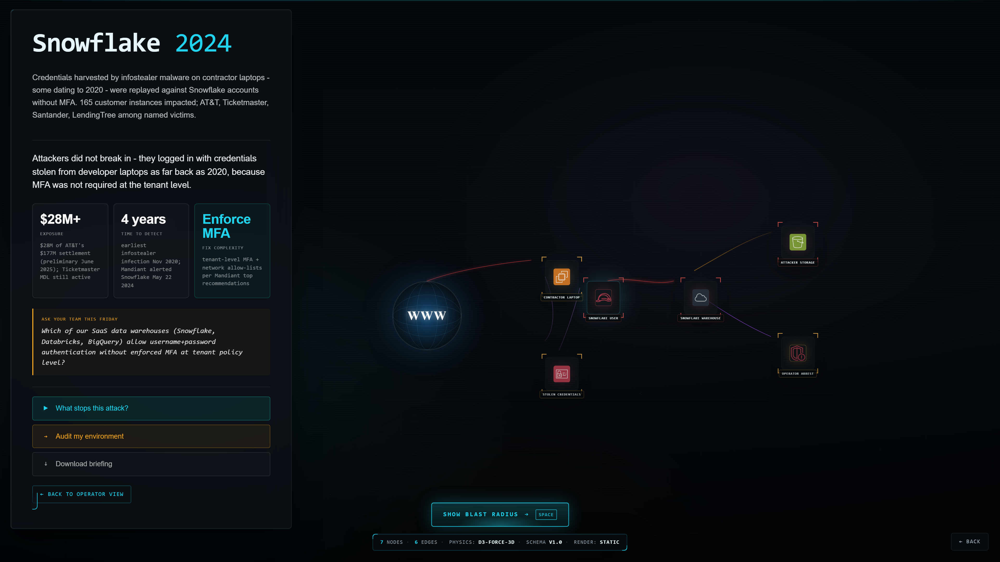
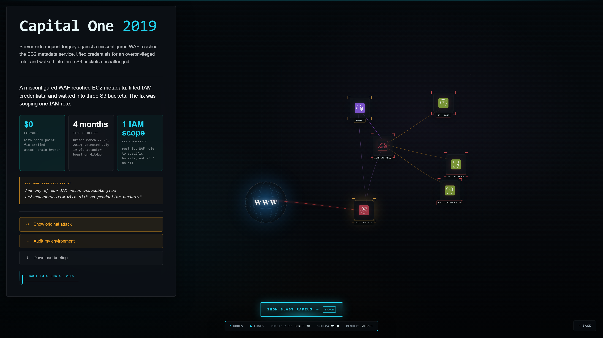
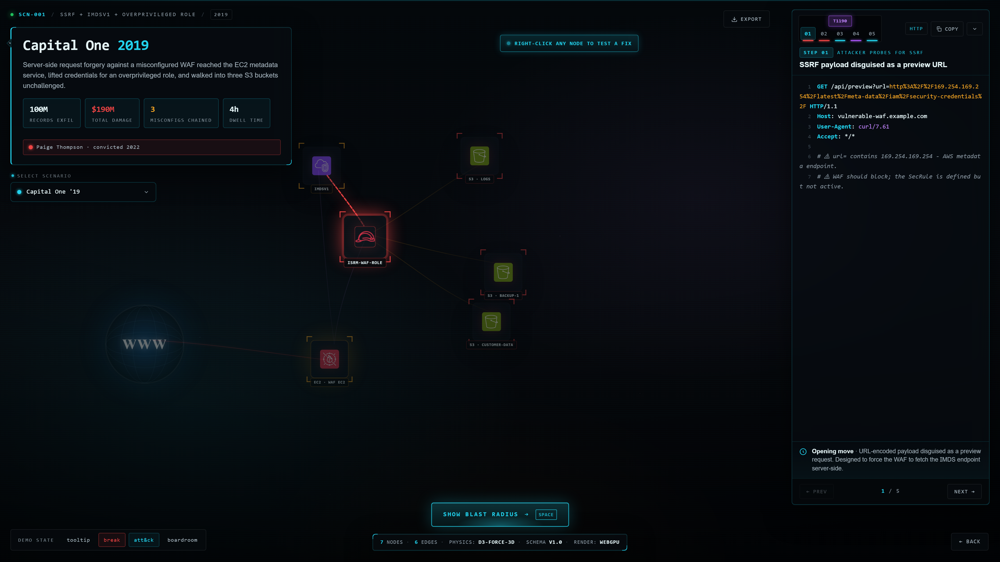

[English](README.md) | [简体中文](README_zh-CN.md)

<p align="center">
  
</p>


<!-- mcp-name: io.github.gebalamariusz/cloud-audit -->

<h1 align="center">cloud-audit</h1>

<p align="center">
  <strong>发现 AWS 攻击路径、IAM 提权路由，以及最值得优先修复的问题。</strong>
</p>

<p align="center">
  开源 CLI 扫描器，帮助您决定优先修复什么——<br>
而不仅仅是哪里出了问题。
</p>

<p align="center">
发现攻击链和 IAM 提权路径 &nbsp;-&nbsp; 在应用修复前进行模拟 &nbsp;-&nbsp; 修复根本原因，而非单个问题
</p>


<p align="center">
  <a href="https://pypi.org/project/cloud-audit/"></a>
  <a href="https://pypi.org/project/cloud-audit/"></a>
  <a href="https://github.com/gebalamariusz/cloud-audit/actions/workflows/ci.yml"></a>
  <a href="https://opensource.org/licenses/MIT"></a>
  <a href="https://pypi.org/project/cloud-audit/"></a>
  <a href="https://ghcr.io/gebalamariusz/cloud-audit"></a>
  <a href="https://www.helpnetsecurity.com/2026/03/11/cloud-audit-open-source-aws-security-scanner/"></a>
  <a href="https://glama.ai/mcp/servers/gebalamariusz/cloud-audit"></a>
  <a href="https://haitmg.pl/cloud-audit/"></a>
</p>


<p align="center">
  <a href="https://haitmg.pl/cloud-audit/">文档</a> -
  <a href="https://haitmg.pl/cloud-audit/getting-started/quick-start/">快速开始</a> -
  <a href="https://haitmg.pl/cloud-audit/features/blast-radius/">Blast Radius</a> -
  <a href="https://blast-audit.haitmg.pl/">在线可视化工具</a> -
  <a href="https://haitmg.pl/cloud-audit/features/attack-chains/">攻击链</a> -
  <a href="https://haitmg.pl/cloud-audit/features/iam-escalation/">IAM 提权</a> -
  <a href="https://haitmg.pl/cloud-audit/features/threat-feed/">威胁情报</a> -
  <a href="https://haitmg.pl/cloud-audit/features/mcp-server/">MCP Server</a>
</p>

<p align="center">
  <a href="https://blast-audit.haitmg.pl/demo/capital-one-2019/?board=1">
    
  </a>
  <br> <sub>将 <code>cloud-audit blast-radius</code> 生成的 JSON 拖放到 <a href="https://blast-audit.haitmg.pl/">blast-audit.haitmg.pl</a> 的在线可视化器中——或点击截图交互式地探索 Snowflake 2024 泄露事件。</sub>
</p>


## 快速开始

```bash
pip install cloud-audit
cloud-audit scan
```

使用默认的 AWS 凭证和区域。无需 AWS 账户即可试用：

```bash
cloud-audit demo
```


### v2.3 新特性：爆炸半径 CLI + 在线可视化工具

> *从任意 AWS 资源出发向外扩展，精确展示攻击者在该资源被攻陷后能触达的范围。*CLI 针对已保存的扫描结果离线运行（计算爆炸半径时零 AWS API 调用）；配套的开放可视化器 [blast-audit.haitmg.pl](https://blast-audit.haitmg.pl/) 可将相同的 JSON 渲染为交互式攻击图，支持断点高亮、MITRE ATT&CK 叠加，以及面向 CFO/CISO 简报的高管会议室模式。

起始节点：EC2 短 ID（`i-XXX`）、IAM 角色/用户 ARN、Lambda ARN、S3 存储桶 ARN、Secrets Manager 密钥 ARN。

```bash
# 1. 运行一次扫描（结果保存至 ~/.cloud-audit/last-scan.json）
cloud-audit scan

# 2. 检查任意资源的爆炸半径（自动使用上次扫描结果）
cloud-audit blast-radius --resource i-0abc123def456              # 树状图（默认）
cloud-audit blast-radius --resource i-0abc123 --format mermaid   # 用于文档/幻灯片
cloud-audit blast-radius --resource i-0abc123 --format markdown  # 用于 PR 评论

# 3. 导出 JSON 并进行交互式可视化
cloud-audit blast-radius --resource arn:aws:iam::123456789012:role/deploy \
                        --format json --output blast.json
# → 打开 https://blast-audit.haitmg.pl/demo/upload/ → 拖入 blast.json
```

<p align="center">
  
  <br>
  <sub>可视化工具的会议室模式内含一键反事实分析——
  <em>"什么措施能阻止这次攻击？"</em>——当您预览推荐的 IAM 修复方案时，风险敞口卡片会以动画形式变为 $0。</sub>
</p>

内置七个历史泄露场景以供参考（Capital One 2019、Cryptomining 2025、AgentCore 2026、Snowflake UNC5537 2024、nx Supply Chain 2026、Codefinger SSE-C 2025、Trivy / TeamPCP 2026），每个场景均附带经验证的一手来源引用。请参阅[爆炸半径文档](https://haitmg.pl/cloud-audit/features/blast-radius/)了解扩展规则、BlastRadiusGraph v1.0 模式及风险评分启发式算法。

### v2.0 以来的其他新功能

| 版本                       | 亮点                                                         |
| -------------------------- | ------------------------------------------------------------ |
| **v2.3.0**（2026 年 5 月） | **爆炸半径 CLI** + 在线可视化器 + 15 项安全加固修复（Mermaid XSS 转义、ID 冲突、BFS 边界、符号链接安全写入、URL 协议白名单）。812 个测试用例。 |
| v2.2.1（2026 年 5 月）     | TF-001 SES 钓鱼邮件爆发升级 + TF-004 防御工具排除。          |
| v2.2.0（2026 年 5 月）     | **威胁情报源 v1**—— 基于 2025-2026 年事件的 10 个活跃滥用检测器（加密挖矿、泄露凭证扫描器、MMDSv1、DataZone、Roles Anywhere、CloudTrail 篡改）。每个发现均附带外部研究参考。 |
| v2.1.0（2026 年 4 月）     | 64 种 IAM 提权方法，完整覆盖 pathfinding.cloud。             |
| v2.0.0（2026 年 4 月）     | IAM 提权图、假设模拟器、趋势追踪、AI-SPM（Bedrock + SageMaker）。 |

各版本的详细变更见 [CHANGELOG.md](CHANGELOG.md)。

### v2.2 新功能：威胁情报源

检测来自 2025-2026 年真实事件的**活跃**滥用模式（加密货币挖矿活动、SES 钓鱼配置、泄露凭证扫描器活动、AgentCore CVE 等）：

```bash
cloud-audit threat-feed              # 扫描全部 10 种模式
cloud-audit threat-feed --list       # 显示已注册的模式
cloud-audit threat-feed --pattern aws-tf-003   # 仅扫描单一模式
```

每种模式的每个发现都带有外部研究参考（Wiz, Datadog Security Labs, Unit 42, Permiso）。检测到 CRITICAL/HIGH 级别时返回退出码 1（对 CI 门禁友好）。详见 [威胁情报文档](https://haitmg.pl/cloud-audit/features/threat-feed/)。

---

## 与众不同之处

大多数扫描器只给你一堆发现项。cloud-audit 帮助您决定**优先修复什么**。

```
+---- 攻击链 (检测到 5 条) ----------------------------------------+
|  严重  暴露于互联网的管理员实例                                    |
|        i-0abc123 - 公开 SG + 管理员 IAM 角色 + IMDSv1            |
|                                                               |
|  严重  通过 iam:PassRole 进行 IAM 权限提升                       |
|        ci-deploy-role - 3 步路径直达管理员权限                   |
|                                                               |
|  严重  CI/CD 到管理员接管                                        |
|        github-deploy - OIDC 无 sub 条件 + 管理员策略             |
+--------------------------------------------------------------+

+---- 修复计划 ----------------------------------------------+
|  修复 4 个根本原因，阻断 22 条攻击链                           |
|                                                           |
|  速赢项 (工作量: 低, 阻断攻击链: 14):                         |
|    1. 限制 sg-0abc123 的 SG 入站规则    -> 阻断 8 条链        |
|    2. 添加 OIDC sub 条件               -> 阻断 6 条链        |
+-----------------------------------------------------------+

```

其他工具给您 200 个按严重程度排序的问题。cloud-audit 按**根本原因**分组，展示哪些单一修复能消除最多的攻击路径，并允许您在实际操作前**模拟**影响：

```bash
cloud-audit simulate --fix aws-vpc-002
# 分数: 34 -> 58 (+24)  |  阻断攻击链: 22 条中的 8 条  |  解决问题: 11 个
```

覆盖 23 个 AWS 服务的 94 项检查。每个发现都包含可直接复制粘贴的 AWS CLI + Terraform 修复方案。

<p align="center">
  <a href="https://www.youtube.com/watch?v=5uHoqggmTB8">
    
  </a>
  <br>
  <sub>观看 1 分钟演示视频</sub>
</p>


---

## 功能矩阵

| 能力                     | 说明                                                         |
| ------------------------ | ------------------------------------------------------------ |
| **爆炸半径 CLI** (v2.3)  | `cloud-audit blast-radius --resource <id>` 从任意 AWS 资源向外遍历，以树状图、JSON ([BlastRadiusGraph v1.0](https://haitmg.pl/cloud-audit/features/blast-radius/#output-json-blastradiusgraph-v10))、Mermaid 或 Markdown 格式输出可达攻击图。JSON 可直接导入[在线可视化器](https://blast-audit.haitmg.pl/)进行交互探索。 |
| **威胁情报源 v1** (v2.2) | 10 个基于真实 2025-2026 年事件的活跃滥用检测器——加密货币挖矿、泄露凭证扫描器、MMDSv1、DataZone 过度授权、Roles Anywhere、CloudTrail 篡改。每个检测器均附带一手来源引用。 |
| **IAM 权限提升** (v2.1)  | 9 大类共 64 种提权方法，包括通过 AssumeRole 图遍历进行的横向移动检测。PMapper 自 v1.1.5（2022年1月）起已停止维护；cloud-audit 提供了 CLI 原生替代方案，覆盖了超出 PMapper IAM 主体范围的额外提权模式。 |
| **假设模拟器** (v2.0)    | `cloud-audit simulate --fix aws-vpc-002` 在应用任何更改前，先展示分数变化、阻断的攻击链数量及风险降低程度。 |
| **根本原因分组** (v2.0)  | "修复 4 个问题，阻断 22 条攻击链。" 按共同根本原因对发现进行分组，并按影响程度排名。 |
| **安全态势趋势** (v2.0)  | `cloud-audit trend` 通过迷你折线图追踪健康分数、攻击链和风险随时间的变化。 |
| **AI-SPM** (v2.0)        | 开源 Bedrock + SageMaker 扫描器。5 项检查，3 条攻击链（模型窃取、LLMjacking、数据投毒）。 |

---

## 核心功能

### 攻击链检测

31 条规则将单个发现项关联为可被利用的攻击路径。

```
互联网 --> 公开 SG --> EC2 (IMDSv1) --> 管理员 IAM 凭证 --> 账户接管
         aws-vpc-002   aws-ec2-004       检测到: AC-01, AC-02
```

| 攻击链               | 捕获内容                                                   |
| -------------------- | ---------------------------------------------------------- |
| IAM 权限提升         | iam:PassRole + lambda:Create + iam:Attach = 3 步直达管理员 |
| 暴露于互联网的管理员 | 公开 SG + 管理员 IAM 角色 + IMDSv1 = 账户接管              |
| CI/CD 到管理员接管   | 无 sub 条件的 OIDC + 管理员策略 = 流水线劫持               |
| LLMjacking           | Bedrock 无日志 + 无护栏 = 未检测到的模型滥用               |

基于 [MITRE ATT&CK Cloud](https://attack.mitre.org/matrices/enterprise/cloud/) 和 [pathfinding.cloud](https://github.com/DataDog/pathfinding.cloud)。[查看全部 31 条规则](https://haitmg.pl/cloud-audit/features/attack-chains/)。

### 修复建议 + 模拟器

每条发现项均包含 AWS CLI、Terraform HCL 修复命令及文档链接。导出所有修复方案：

```bash
cloud-audit scan --export-fixes fixes.sh  
```

在应用前模拟效果：

```bash
cloud-audit simulate --fix aws-vpc-002
# 分数: 34 -> 58 (+24)  |  阻断攻击链: 22 条中的 8 条  |  解决问题: 11 个

cloud-audit simulate --fix aws-vpc-002,aws-ct-001,aws-iam-007
# 分数: 34 -> 82 (+48)  |  阻断攻击链: 22 条中的 19 条
```

### 趋势追踪

```bash
cloud-audit diff yesterday.json today.json    # 捕获 ClickOps 漂移
cloud-audit trend                              # 查看安全态势随时间的变化
```

### 6 大合规框架

- **CIS AWS v3.0**——62 项控制，55 项自动化（89%）
- **SOC 2 Type II**——43 项准则，24 项自动化（56%）
- **BSI C5:2020** `Beta`——134 项准则，57 项自动化/部分自动化
- **ISO 27001:2022** `Beta`——93 项控制，47 项自动化/部分自动化
- **HIPAA Security Rule** `Beta`——47 项规范，29 项自动化/部分自动化
- **NIS2 指令** `Beta`——43 项措施，33 项自动化/部分自动化

### 泄露成本估算

每个发现项和攻击链均包含基于 IBM/Verizon 泄露数据的美元风险区间估算，并附来源链接。

### 面向 AI Agent 的 MCP Server

```bash
claude mcp add cloud-audit -- uvx --from cloud-audit cloud-audit-mcp
```

提供 6 个工具：`scan_aws`、`get_findings`、`get_attack_chains`、`get_remediation`、`get_health_score`、`list_checks`。免费且独立运行。

---

## 与其他工具对比

[Prowler](https://github.com/prowler-cloud/prowler) 是 AWS 安全领域的标杆工具：覆盖 84 个服务的 600 项检查、44 个合规框架（CIS、PCI-DSS、HIPAA、SOC2、NIST 800、ISO 27001、GDPR、FedRAMP、NIS2、MITRE ATT&CK 等）、自动修复功能，以及 Prowler App 中基于图的攻击路径分析（Cartography + Neo4j）。同时支持 Azure、GCP、Kubernetes、M365 等多个平台。

cloud-audit 仅面向 AWS，且有意聚焦更窄的范围（94 项精选检查）。它在 Prowler 追求广度的地方追求深度：攻击链关联和 IAM 提权检测在免费 CLI 中原生运行，无需基础设施；每个发现都附带可审查的 Terraform + AWS CLI 修复方案；扫描差异/漂移跟踪内置于 CLI 中。

| 特性                                 | Prowler                                                      | cloud-audit                                               |
| ------------------------------------ | ------------------------------------------------------------ | --------------------------------------------------------- |
| AWS 检查项                           | 84 个服务共 600 项                                           | 23 个服务共 94 项                                         |
| 合规框架 (AWS)                       | 44 个 (CIS, PCI-DSS, HIPAA, SOC2, NIST, ISO 27001, GDPR, FedRAMP, NIS2, ...) | 6 个 (CIS v3.0, SOC 2, BSI C5, ISO 27001, HIPAA, NIS2)    |
| 自动修复                             | 17 个 AWS 服务共 55 个修复器（直接 API 调用）                | 94/94 个发现均有 CLI + Terraform 输出（可审查，由您应用） |
| 攻击路径/图分析                      | Prowler App (Cartography + 图查询)                           | CLI 原生 (31 条规则，无需基础设施)                        |
| IAM 提权图                           | Prowler App                                                  | CLI 原生 (61 种方法 + AssumeRole 图)                      |
| 假设修复模拟器                       | 无                                                           | 有                                                        |
| AI/ML 安全检查 (Bedrock + SageMaker) | 约 20 项检查                                                 | 5 项检查 + 3 条攻击链规则                                 |
| 扫描差异/漂移跟踪                    | Prowler App                                                  | 内置 CLI (`cloud-audit diff`)                             |
| 泄露成本估算 (USD)                   | 无                                                           | 每个发现 + 每条攻击链均有                                 |
| MCP 服务器                           | 免费                                                         | 免费                                                      |
| 多云支持                             | AWS + 13 个其他平台                                          | 仅 AWS                                                    |
| 许可证                               | Apache 2.0                                                   | MIT                                                       |

如需合规广度、多云覆盖及基于图的攻击路径分析，选 Prowler；如需快速的 CLI 原生攻击链检测、可审查的 Terraform 修复方案及 CI/CD 漂移追踪，选 cloud-audit。两者互补而非竞争——常见组合是 Prowler 用于季度合规取证，cloud-audit 每日运在 CI/CD 流水线中运行。

<sub>Prowler 数据统计验证于 2026-05-25 从 github.com/prowler-cloud/prowler 。cloud-audit 数据截至 v2.3.0。</sub>

### 关于**爆炸半径**

现有 AWS blast-radius 工具要么藏身于付费 SaaS、要么需要搭建 Neo4j + Cartography、要么已多年无人维护。`cloud-audit blast-radius` 旨在提供一个轻量级的原生 CLI 替代方案：支持任意 AWS 资源作为起始节点（EC2、IAM、Lambda、S3、密钥），提供有文档约定的 JSON 契约（BlastRadiusGraph v1.0）供下游工具消费，无需搭建任何基础设施。

| 工具                            | 从任意 AWS 资源前向 BFS？                   | 纯 CLI？                     | 最近发布                         |
| ------------------------------- | ------------------------------------------- | ---------------------------- | -------------------------------- |
| Wiz / Stream Security CloudTwin | 是                                          | 否（付费 SaaS）              | 活跃                             |
| Prowler App                     | 是                                          | 否（需 Neo4j + Cartography） | 活跃                             |
| Prowler CLI                     | 否                                          | 是                           | 活跃                             |
| PMapper                         | 仅 IAM，针对提权至管理员优化                | 是                           | v1.1.5，2022 年 1 月（已停维护） |
| Cloudsplaining                  | 否（仅 IAM 策略分析）                       | 是                           | v0.8.2，2024 年 10 月            |
| CloudFox                        | AWS 无此功能（`lateral-movement` 仅限 GCP） | 是                           | 活跃                             |
| DetentionDodger                 | 仅 IAM，仅针对隔离后用户                    | 是                           | v1.0，2024 年 10 月              |
| awspx                           | 部分支持（图 + Web UI）                     | Docker                       | v1.3.4，2021 年 8 月（已停维护） |
| ScoutSuite                      | 否                                          | 是                           | v5.14.0，2024 年 5 月            |
| Cartography                     | 无内置支持（需自写 Cypher）                 | 否（图摄取器）               | 活跃                             |
| BloodHound CE                   | AWS 不支持（仅限 AD + Azure）               | 否（Web 应用）               | 活跃                             |
| pathfinding.cloud               | 否（仅为目录）                              | 不适用                       | 不适用                           |
| Trivy                           | 否                                          | 是                           | 活跃                             |
| **cloud-audit blast-radius**    | **是**                                      | **是**                       | **v2.3.0，2026 年 5 月**         |

配套可视化工具 [blast-audit.haitmg.pl](https://blast-audit.haitmg.pl/) 消费同一份 JSON，无需账号、无需安装、无需上传至第三方云——所有运算均在浏览器本地完成。

---

## 报告导出

```bash
cloud-audit scan --format html -o report.html     # 适合交付客户的 HTML
cloud-audit scan --format json -o report.json      # 机器可读
cloud-audit scan --format sarif -o results.sarif   # GitHub Code Scanning
cloud-audit scan --format markdown -o report.md    # PR 评论
```

## 安装

```bash
pip install cloud-audit          # pip（推荐）
pipx install cloud-audit         # pipx（隔离安装）
docker run ghcr.io/gebalamariusz/cloud-audit scan  # Docker
```

使用凭证的 Docker 运行方式：

```bash
docker run -v ~/.aws:/home/cloudaudit/.aws:ro ghcr.io/gebalamariusz/cloud-audit scan
```

## 使用方法

```bash
cloud-audit scan -R                                    # 显示修复方案
cloud-audit scan --profile prod --regions eu-central-1  # 指定 profile/区域
cloud-audit scan --regions all                          # 扫描所有已启用区域
cloud-audit scan --min-severity high                   # 按严重程度过滤
cloud-audit scan --role-arn arn:aws:iam::...:role/audit # 跨账户扫描
cloud-audit scan --quiet                               # 仅返回退出码（适用于 CI/CD）
cloud-audit simulate --fix aws-vpc-002                 # 假设模拟器
cloud-audit trend                                      # 查看安全态势趋势
cloud-audit list-checks                                # 列出所有检查项
```

| 退出码 | 含义           |
| ------ | -------------- |
| 0      | 未发现任何问题 |
| 1      | 检测到问题     |
| 2      | 扫描错误       |

<details>
<summary>配置文件</summary>


在项目根目录创建 `.cloud-audit.yml`：

```yaml
provider: aws
regions:
  - eu-central-1
  - eu-west-1
min_severity: medium
exclude_checks:
  - aws-eip-001
suppressions:
  - check_id: aws-vpc-001
    resource_id: vpc-abc123
    reason: "Legacy VPC, migration planned for Q3"
    accepted_by: "jane@example.com"
    expires: "2026-09-30"
  - check_id: "aws-cw-*"
    reason: "CloudWatch alarms managed by separate team"
    accepted_by: "ops@example.com"
```

</details>

<details>
<summary>环境变量</summary>


| 变量                         | 示例                            |
| ---------------------------- | ------------------------------- |
| `CLOUD_AUDIT_REGIONS`        | `eu-central-1,eu-west-1`        |
| `CLOUD_AUDIT_MIN_SEVERITY`   | `high`                          |
| `CLOUD_AUDIT_EXCLUDE_CHECKS` | `aws-eip-001,aws-iam-001`       |
| `CLOUD_AUDIT_ROLE_ARN`       | `arn:aws:iam::...:role/auditor` |

优先级：CLI 参数 > 环境变量 > 配置文件 > 默认值。

</details>

## CI/CD 集成

```yaml
- run: pip install cloud-audit
- run: cloud-audit scan --format sarif --output results.sarif
- uses: github/codeql-action/upload-sarif@v3
  with:
    sarif_file: results.sarif
```

开箱即用的工作流模板：[基础扫描](examples/github-actions.yml)、[每日差异对比](examples/daily-scan-with-diff.yml)、[部署后扫描](examples/post-deploy-scan.yml)。

## AWS 权限

cloud-audit 仅需**只读**权限。附加 `SecurityAudit` 策略即可覆盖所有检查（包括 IAM 提权分析）：

```bash
aws iam attach-role-policy --role-name auditor --policy-arn arn:aws:iam::aws:policy/SecurityAudit
```

cloud-audit 不会修改你的任何基础设施。`simulate` 命令在本地针对扫描数据运行——不调用 AWS API。

## 检查范围

覆盖 IAM、S3、EC2、VPC、RDS、EIP、EFS、CloudTrail、GuardDuty、KMS、CloudWatch、Lambda、ECS、SSM、Secrets Manager、AWS Config、Security Hub、Account、AWS Backup、Amazon Inspector、AWS WAF、Amazon Bedrock 和 Amazon SageMaker 共 23 个服务的 94 项检查。

[按服务查看全部 94 项检查](https://haitmg.pl/cloud-audit/checks/)，或在本地运行 `cloud-audit list-checks`。

## 文档

完整文档见 **[haitmg.pl/cloud-audit](https://haitmg.pl/cloud-audit/)**：

- **[快速开始](https://haitmg.pl/cloud-audit/getting-started/installation/)** - 安装、快速上手、演示模式
- **[Blast Radius](https://haitmg.pl/cloud-audit/features/blast-radius/)** - 从任意 AWS 资源正向 BFS、JSON 模式、可视化器集成
- **[攻击链](https://haitmg.pl/cloud-audit/features/attack-chains/)** - 全部 31 条规则及 MITRE ATT&CK 引用
- **[IAM 提权](https://haitmg.pl/cloud-audit/features/iam-escalation/)** - 64 种方法、9 个类别（基于动作 + 横向 AssumeRole 图）
- **[威胁情报](https://haitmg.pl/cloud-audit/features/threat-feed/)** - 基于 2025-2026 年事件的 10 个活跃滥用检测器
- **[What-If 模拟器](https://haitmg.pl/cloud-audit/features/simulate/)** - 模拟修复影响
- **[合规](https://haitmg.pl/cloud-audit/compliance/overview/)** - 6 个框架：CIS、SOC 2、BSI C5、ISO 27001、HIPAA、NIS2
- **[全部 94 项检查](https://haitmg.pl/cloud-audit/checks/)** - 按服务分类的完整检查参考

## 配套可视化工具

`cloud-audit blast-radius --format json` 输出的 BlastRadiusGraph v1.0 JSON 同样驱动 **[blast-audit.haitmg.pl](https://blast-audit.haitmg.pl/)** 在线可视化工具——无需安装、无需注册、无需上传至第三方云（所有内容均在浏览器本地运行）。

<p align="center">
  <a href="https://blast-audit.haitmg.pl/demo/capital-one-2019/">
    
  </a>
</p>

内置七个历史泄露场景，均附一手来源引用：

| 场景                | 年份 | 简述                                                         | URL                                                          |
| ------------------- | ---- | ------------------------------------------------------------ | ------------------------------------------------------------ |
| Capital One         | 2019 | SSRF → IMDSv1 → 管理员 S3（1亿条记录，总损失1.9亿美元）      | [/demo/capital-one-2019/](https://blast-audit.haitmg.pl/demo/capital-one-2019/) |
| 加密货币挖矿        | 2025 | 泄露的 AKID → 10分钟内启动14个ASG                            | [/demo/cryptomining-2025/](https://blast-audit.haitmg.pl/demo/cryptomining-2025/) |
| Bedrock AgentCore   | 2026 | 通过 DNS 解析器绕过沙箱（AWS 判定为"不予修复"）              | [/demo/agentcore-2026/](https://blast-audit.haitmg.pl/demo/agentcore-2026/) |
| Snowflake / UNC5537 | 2024 | 信息窃取软件收集的凭证被回放至无 MFA 租户（165 个组织，AT&T 和解金超 2800 万美元） | [/demo/snowflake-unc5537-2024/](https://blast-audit.haitmg.pl/demo/snowflake-unc5537-2024/) |
| nx 供应链 / UNC6426 | 2026 | 木马化 npm → LLM 信息窃取 → GitHub OIDC → AWS 管理员，全程不足 72 小时 | [/demo/unc6426-nx-2026/](https://blast-audit.haitmg.pl/demo/unc6426-nx-2026/) |
| Codefinger          | 2025 | AWS 原生 SSE-C 勒索软件（CloudTrail 无法恢复密钥）           | [/demo/codefinger-ssec-2025/](https://blast-audit.haitmg.pl/demo/codefinger-ssec-2025/) |
| Trivy / TeamPCP     | 2026 | 77个 GitHub Action 标签中有76个被强制推送为凭证窃取程序      | [/demo/trivy-teampcp-2026/](https://blast-audit.haitmg.pl/demo/trivy-teampcp-2026/) |

会议室模式（在任何场景 URL 后加 `?board=1`）将同一张图渲染为 CFO/CISO 简报视图，以三个大卡片突出显示风险金额、检测时间和推荐修复方案——点击"*什么措施能阻止这次攻击？(What stops this attack?)*"，风险卡片会以动画变为 $0。

## 后续计划

- 多账户扫描（AWS Organizations）
- IAM 提权分析中引入 SCP + 权限边界评估
- Terraform 配置漂移检测
- Security Graph v3.0.0（网络可达性、跨账户传播、权限边界语义）

历史发布记录：[CHANGELOG.md](CHANGELOG.md)

## 参与开发

```bash
git clone https://github.com/gebalamariusz/cloud-audit.git
cd cloud-audit
pip install -e ".[dev]"

pytest -v                          # 812 个测试用例
ruff check src/ tests/             # 代码规范检查
mypy src/                          # 类型检查
```

如需了解如何新增检查项，请参阅 [CONTRIBUTING.md](CONTRIBUTING.md)。

## 许可证

[MIT](LICENSE) - Mariusz Gebala / [HAIT](https://haitmg.pl)
